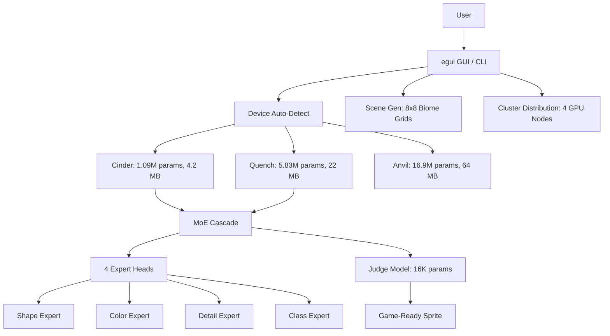

<!-- Unlicense — cochranblock.org -->

# Proof of Artifacts

*Concrete evidence that this project works, ships, and is real.*

> Three AI models. First MoE diffusion under 30MB. Pure Rust. No cloud.

## Architecture



## Build Output

| Metric | Value |
|--------|-------|
| Lines of Rust | 9,162 across 29 modules |
| Model: Cinder | 1.09M params, 4.2 MB (2.1 MB f16) |
| Model: Quench | 5.83M params, 22 MB (11 MB f16) |
| Model: Anvil | 16.9M params, 64 MB (32 MB f16) |
| MoE cascade | Cinder + Quench + 4 experts = under 30 MB |
| Judge model | 16K params — quality gate in microseconds |
| Training data | 52,139 curated sprites from 7 CC0/CC-BY sources |
| Dataset size | 10 MB zstd-compressed bincode (RAM-loaded, zero disk I/O) |
| Android APK | 19 MB (Cinder + Quench bundled) |
| Sprite classes | 16 (character, weapon, terrain, enemy, etc.) |
| ML framework | Candle (pure Rust — Metal, CUDA, CPU) |

## Key Artifacts

| Artifact | Description |
|----------|-------------|
| MoE Cascade | First under 30MB — Cinder drafts (10 steps), Quench + 4 expert heads refine (30 steps) |
| Expert Routing | Shape (steps 1-10), Color (11-20), Detail (21-30), Class (31-40) |
| Judge Model | Binary classifier trained from user swipes — filters bad sprites in microseconds |
| LoRA Adapters | Rank-4 on all conv layers — fine-tune from 200 swipes without retraining |
| Scene Generation | 8x8 biome grids (dungeon, forest, cave, village, space) with constraint satisfaction |
| Device Auto-Detect | Probes GPU/RAM, selects optimal tier, benchmarks, degrades gracefully |
| f16 Quantization | Halves model sizes for mobile without quality loss |
| Proof of Authorship | Ed25519 signed Ghost Fabric packets |

## Training Data Sources

| Source | Count | License |
|--------|-------|---------|
| Dungeon Crawl Stone Soup | 6,000+ | CC0 |
| DawnLike v1.81 | 5,000+ | CC-BY 4.0 |
| Kenney Roguelike/RPG | 1,700 | CC0 |
| Kenney Pixel Platformer | 1,100 | CC0 |
| Kenney 1-Bit Pack | 1,078 | CC0 |
| Hyptosis Tiles | 1,000+ | CC-BY 3.0 |
| David E. Gervais Tiles | 1,280 | CC-BY 3.0 |

## How to Verify

```bash
cargo build --release -p pixel-forge
cargo run --release -- auto character    # Auto-detect hardware, generate sprite
cargo run --release -- cascade character --count 16   # MoE cascade
cargo run --release                      # Launch GUI
```

---

*Part of the [CochranBlock](https://cochranblock.org) zero-cloud architecture. All source under the Unlicense.*
