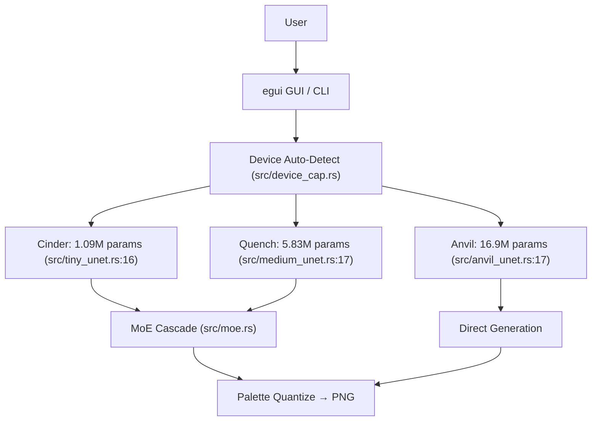

<!-- Unlicense — cochranblock.org -->

# Proof of Artifacts

*Concrete evidence that this project builds, trains, and generates output. Source-linked.*

## Architecture



Note: Expert heads, Judge model, and Scene generation exist as code but are not validated at output quality. See Status column below.

## Build Output

| Metric | Value | Source |
|--------|-------|--------|
| Lines of Rust | ~17,311 across 39 .rs files | `find src -name "*.rs" \| xargs wc -l` |
| Direct dependencies | 16 required + 3 optional | [Cargo.toml:27](Cargo.toml#L27) |
| Binary size (macOS ARM) | 9.2 MB (opt-level=z, LTO, strip) | [release/](release/) |
| Binary size (macOS x86) | 7.6 MB | [release/](release/) |
| Binary size (Linux x86) | 11.3 MB | [release/](release/) |
| Model: Cinder | 1.09M params, 4.2 MB | [src/tiny_unet.rs:16](src/tiny_unet.rs#L16), channels `[32,64,64]` |
| Model: Quench | 5.83M params, 22 MB | [src/medium_unet.rs:17](src/medium_unet.rs#L17), channels `[64,128,128]` |
| Model: Anvil | 16.9M params, 64.5 MB | [src/anvil_unet.rs:17](src/anvil_unet.rs#L17), channels `[96,192,192]` |
| Param count verification | Assertions in test | [src/device_cap.rs:492](src/device_cap.rs#L492) |
| Training data (balanced) | 19,876 tiles, 68 active classes, capped 2K/class | [train::preprocess](src/train.rs#L221), count at [train.rs:320](src/train.rs#L320) |
| Training data (unbalanced) | 75K+ tiles in `data_v2_32/`, 108 class dirs | [class_cond.rs:84](src/class_cond.rs#L84) (lookup table) |
| Dataset composition | ~30% artist-made CC0/CC-BY, ~70% Gemini-generated | [data/SOURCES.md](data/SOURCES.md) |
| Dataset size (compressed) | ~24 MB zstd bincode (RAM-loaded, zero disk I/O) | [train.rs:321](src/train.rs#L321) |
| Class conditioning | 10 super-categories + 12 binary tags | [class_cond.rs:12](src/class_cond.rs#L12), [class_cond.rs:16](src/class_cond.rs#L16) |
| ML framework | Candle 0.8 (Metal, CUDA, CPU) | [Cargo.toml:32](Cargo.toml#L32) |
| Governance docs | 11 documents baked into binary | [main.rs:10](src/main.rs#L10) via `include_str!` |
| Noise type | Gaussian N(0,1) | [train.rs:432](src/train.rs#L432) (corrupt function) |
| Prediction target | Clean image | [train.rs:759](src/train.rs#L759) (DEFAULT_CFG_SCALE) |
| CFG scale | 3.0 (fixed from 1.0 on 2026-04-02) | [train.rs:759](src/train.rs#L759), commit `68f2183a` |
| Augmentation | palette swap, h-flip, rotation (0/90/180/270), brightness ×[0.8,1.2] | [train.rs:702-718](src/train.rs#L702) |
| Model integrity | NanoSign: BLAKE3 sign on save, verify on load | [src/nanosign.rs](src/nanosign.rs), spec: [NANOSIGN.md](https://github.com/cochranblock/kova/blob/main/docs/NANOSIGN.md) |
| Diffusion recipe | EDM (Karras 2022): log-normal σ + σ-precond + Min-SNR-**γ=13** (was γ=5, was no-op) | [src/precond.rs](src/precond.rs), commits `8d68ff82` `6b2d32f1` `a1f61fda` `3f72254b` |
| BCE silhouette recipe | No diffusion: sigmoid + stable BCE-with-logits, h-flip + rotation only | [src/train.rs](src/train.rs) `train_bce_inner`, commit `2640e90e` |
| Data normalization | Per-channel z-score with mandatory `.normalize.json` sidecar | [src/normalize.rs](src/normalize.rs), commit `701eea94` |
| σ_data (EDM constant) | 0.4007 (RMS of per-channel std on `data_v3_32`) | [data_v3_32/normalize.json](data_v3_32/normalize.json) |
| GPU backends | CUDA, Metal, **Vulkan via [any-gpu](https://github.com/cochranblock/any-gpu)**, CPU | [Cargo.toml:31](Cargo.toml#L31), [src/vulkan_tiny.rs](src/vulkan_tiny.rs) |
| Browser inference | WASM crate — Cinder via WebGPU through any-gpu | commit `b649e42f`, mirrors z-score per `06ee6b50` |

## Training Loss (Anvil v6, 200 epochs on lf RTX 3070)

Source: `train-anvil-v6.log` on lf (`ssh lf 'cat ~/pixel-forge/train-anvil-v6.log'`)

| Epoch | Loss | LR | Time/epoch |
|-------|------|----|------------|
| 1 | 0.1927 | 1.0e-5 | 753s |
| 6 | 0.0799 | 1.1e-4 | 769s |
| 51 | 0.0654 | 1.8e-4 | 761s |
| 101 | 0.0653 | 1.1e-4 | 750s |
| 151 | 0.0562 | 4.1e-5 | 740s |
| 200 | 0.0542 | 1.0e-5 | 756s |

Total training time: 151,441 seconds (~42 hours). Config: bs=16, lr=2e-4, cosine decay, no EMA, min-SNR=5.

**Anvil v7** (in progress as of 2026-04-02): fine-tuning from v6, bs=8, lr=5e-5, rotation augmentation, no EMA. Running on lf CPU.

## Anvil-BCE Silhouette Training (in progress, started 2026-05-18)

First stage of the Shape-Diffusion Signal Split cascade. BCE loss (no diffusion) on binary silhouette masks. Source: `/tmp/anvil-bce.log` on lf.

| Setting | Value |
|---------|-------|
| Tier | Anvil (AnvilUNet, 3-channel input) |
| Params | 16,908,643 (64.5 MB) |
| Recipe | **BCE (no diffusion)** — hflip + rotation only, sigmoid + stable BCE with logits |
| Batch size | 16 |
| Learning rate | 2e-4 with cosine decay, 5-epoch warmup |
| Epochs target | 200 |
| Data | `data_sil_32/` — 20,599 binary silhouette masks (R=G=B=mask, α→binary) |
| Backend | CUDA (RTX 3070 on lf), 100% GPU util, ~2.7 GB VRAM |
| Per-epoch time | ~14 min |
| Output | `pixel-forge-anvil-sil.safetensors` |

**Loss trajectory (confirmed descending, no plateau):**

| Epoch | Loss | Notes |
|-------|------|-------|
| 1 | 0.314 | Random init; baseline ln(2) ≈ 0.693 |
| 11 | 0.160 | >50% reduction |
| 21 | 0.122 | EDM plateau point — BCE still descending |
| 46 | 0.093 | Continuing to drop |

## Quench EDM (abandoned 2026-05-18 — replaced by BCE cascade)

EDM training ran but plateau'd. Source: `/tmp/quench-g13.log` on lf.

| Setting | Value |
|---------|-------|
| Tier | Quench (MediumUNet, 3-channel input) |
| Params | 5,832,643 (22.2 MB) |
| Recipe | EDM (log-normal σ + σ-precond + **Min-SNR-γ=5 → fixed to γ=13**) |
| Batch size | 16 |
| Learning rate | 2e-4 with cosine decay |
| Result | **Plateau at epoch 11 (loss 8.97), same as γ=5 run** — EDM wrong for binary targets |

**Diagnosis:** γ=5 was a no-op for σ_data=0.4007 (1/σ_data²=6.23>5, clamps every sample). Fixed to γ=13 in `3f72254b`. Even with γ=13, plateau persisted — root cause is that EDM's continuous Gaussian noise model is fundamentally mismatched to binary pixel art structure. Replaced by BCE cascade.

## Recipe Migration Status (2026-05-18)

| Checkpoint | Trained recipe | Sidecar present | Loadable now | Notes |
|------------|---------------|-----------------|--------------|-------|
| `pixel-forge-cinder.safetensors` (Apr 19) | Legacy DDPM, no z-score | No | **No — bricked** | The "blob characters" model. Inference path removed in `a1f61fda`. |
| `pixel-forge-quench.safetensors` (Mar 19, pre-Quench-EDM) | Legacy DDPM, no z-score | No | **No — bricked** | Will be replaced by Quench EDM run output. |
| `pixel-forge-quench.safetensors` (May 15+, in progress) | EDM | Yes | Yes (once first save lands) | Active training. |
| `models/cinder-edm-vk.safetensors` (May 6, 10 epochs) | EDM via Vulkan/any-gpu | Yes | Yes — but undertrained (samples are noise) | Validates Vulkan path; not enough epochs. |
| 18 per-class silo MicroUNets (Apr 11+) | Legacy DDPM | No | Mixed — silos use a separate path | Tiered pipeline still works for shape stage. |

## QA Results (2026-03-27, updated 2026-04-02)

| Test | Result | Notes |
|------|--------|-------|
| `cargo build --release` | PASS | 0 errors, 0 warnings |
| `cargo clippy --release -- -D warnings` | PASS | 0 remaining lints |
| Clean build | PASS | ~57s incremental, ~5m from scratch |

## Key Artifacts

| Artifact | Status | Source |
|----------|--------|--------|
| Diffusion training loop | working | [src/train.rs:501](src/train.rs#L501) |
| Anvil UNet (16.9M params) | working, training | [src/anvil_unet.rs](src/anvil_unet.rs) |
| Quench UNet (5.83M params) | working, trained | [src/medium_unet.rs](src/medium_unet.rs) |
| Cinder UNet (1.09M params) | working, trained | [src/tiny_unet.rs](src/tiny_unet.rs) |
| MoE Cascade pipeline | code exists, not validated at quality | [src/moe.rs:72](src/moe.rs#L72) |
| Expert Routing | code exists, not validated at quality | [src/expert.rs](src/expert.rs), [src/expert_train.rs](src/expert_train.rs) |
| Judge Model | code exists, needs swipe training data | [src/judge.rs](src/judge.rs) |
| LoRA Adapters | code exists, needs judge model | [src/lora.rs](src/lora.rs) |
| Scene Generation | code exists, needs trained combiner | [src/scene.rs](src/scene.rs), [src/combiner.rs](src/combiner.rs) |
| Device Auto-Detect | working | [src/device_cap.rs:369](src/device_cap.rs#L369) |
| f16 Quantization | working | [src/quantize.rs:40](src/quantize.rs#L40) |
| Proof of Authorship | working | [src/poa.rs](src/poa.rs) (Ed25519 signed) |
| Hybrid Conditioning | working | [src/class_cond.rs:12](src/class_cond.rs#L12) |
| Cluster Distribution | working | [src/cluster.rs:20](src/cluster.rs#L20) (4 SSH nodes) |
| Relight (4-dir sprites) | working | [src/relight.rs](src/relight.rs) |
| Palette Quantization | working | [src/palette.rs:55](src/palette.rs#L55) |
| Governance Docs | working (self-assessed) | [govdocs/](govdocs/), [main.rs:10](src/main.rs#L10) |
| Android AAB | builds, not published | [android/](android/) |
| `--resume` fine-tuning | working | [src/train.rs:59](src/train.rs#L59), commit `d4b28270` |
| NanoSign (BLAKE3 model signing) | working | [src/nanosign.rs](src/nanosign.rs), 6 save + 10 load paths, commit `92748094` |
| EDM preconditioning | working, end-to-end smoke-tested on Quench + Anvil | [src/precond.rs](src/precond.rs), 8 unit tests, commits `8d68ff82` `6b2d32f1` `a1f61fda` |
| z-score normalize sidecar | working, mandatory at train + sample | [src/normalize.rs](src/normalize.rs), commit `701eea94` |
| Vulkan/any-gpu backend (Cinder) | working — TinyUNet trains end-to-end on AMD via Vulkan | [src/vulkan_tiny.rs](src/vulkan_tiny.rs), commit `5469b0dd` |
| Vulkan/any-gpu backend (silos) | working — MicroUNet trains via any-gpu | [src/vulkan_backend.rs](src/vulkan_backend.rs), commit `a68a6c0f` |
| Per-class siloed MicroUNets | working — 18 silos trained, ~97K params each | [src/micro_unet.rs](src/micro_unet.rs), [models/](models/), commit `de887913` |
| Tiered pipeline (silo → PaletteNet → Cinder-detail) | code complete, end-to-end runnable | [src/tiered_pipeline.rs](src/tiered_pipeline.rs), commit `37220e05` |
| PaletteNet (~100K MLP) | working — predicts 8 class-appropriate palette colors | [src/palette_net.rs](src/palette_net.rs) |
| Sponge Mesh (auto-retry training) | working — `--sponge` flag retries on NaN/plateau | [src/sponge.rs](src/sponge.rs), commit `ebafcb2b` |
| any-gpu fleet training (`train-fleet`) | working — multi-node distributed training | [src/cluster.rs](src/cluster.rs), commit `2a3dc0f1` |
| WASM crate (browser inference) | working — Cinder via WebGPU through any-gpu | commit `b649e42f`, beta page wired `2888c8b1` |
| Quality-check CLI | working — per-image stats + cross-image diversity | commit `7cef7c9f` |
| Apr 19 Cinder checkpoint | **bricked** — no sidecar; legacy DDPM inference path removed | see Recipe Migration Status above |

## Training Data Sources

| Source | Count | License | Notes |
|--------|-------|---------|-------|
| Dungeon Crawl Stone Soup | ~6,000 | CC0 | [data/SOURCES.md](data/SOURCES.md) |
| DawnLike v1.81 | ~5,000 | CC-BY 4.0 | [data/SOURCES.md](data/SOURCES.md) |
| Kenney (3 packs) | ~3,878 | CC0 | [data/SOURCES.md](data/SOURCES.md) |
| Hyptosis Tiles | ~1,000 | CC-BY 3.0 | [data/SOURCES.md](data/SOURCES.md) |
| David E. Gervais Tiles | ~1,280 | CC-BY 3.0 | [data/SOURCES.md](data/SOURCES.md) |
| **Gemini-generated** | **~14,000** | **AI-generated** | Fills class gaps. ~70% of balanced set. |

## Quick Start

```bash
# Build (Metal GPU on macOS, CPU fallback)
cargo build --release

# Build with CUDA (NVIDIA GPU on Linux)
cargo build --release --features cuda --no-default-features

# Build with Vulkan (AMD/Intel via any-gpu)
cargo build --release --features vulkan

# Launch GUI
cargo run --release

# Generate (requires a trained model)
cargo run --release -- anvil character --count 4 --steps 40 --palette stardew

# List palettes
cargo run --release -- palettes
```

### Training

Dataset: ~20K balanced tiles in `data_v3_32/`. See [data/SOURCES.md](data/SOURCES.md). EDM recipe requires `data_v3_32/normalize.json` — generate with `pixel-forge normalize-stats --data data_v3_32`.

```bash
# Train Anvil EDM (~6 min/epoch fp16 on RTX 3070, ~22 hrs for 200 epochs)
cargo run --release -- train --data data_v3_32 --anvil --epochs 200 \
  --lr 2e-4 --batch-size 16 --no-ema --fp16 --checkpoint-every 5

# Train Quench EDM (~6 min/epoch fp16)
cargo run --release -- train --data data_v3_32 --medium --epochs 200 \
  --lr 2e-4 --batch-size 16 --no-ema --fp16 --checkpoint-every 5

# Train Cinder (fast, ~1.5 min/epoch CPU, much faster on GPU)
cargo run --release -- train --data data_v3_32 --epochs 500 \
  --lr 2e-4 --batch-size 128 --no-ema --fp16

# Train Cinder via Vulkan/any-gpu (AMD-friendly)
cargo run --release --features vulkan -- train-cinder-vk \
  --data data_v3_32 --epochs 200

# Fine-tune from existing checkpoint
cargo run --release -- train --data data_v3_32 --anvil --epochs 100 \
  --lr 5e-5 --batch-size 8 --resume pixel-forge-anvil-v6.safetensors \
  -o pixel-forge-anvil-v7.safetensors
```

## How to Verify

```bash
cargo build --release -p pixel-forge
cargo run --release -- anvil character --count 4 --steps 40 --palette stardew
cargo run --release -- probe              # Device detection
cargo run --release                       # Launch GUI
find src -name "*.rs" | xargs wc -l       # Line count
```

## CLI Commands

| Command | Status | What It Does |
|---------|--------|-------------|
| `train` | working | Train Cinder/Quench/Anvil — EDM (color) or `--bce` (silhouette shape) |
| `train-cinder-vk` | working | Train Cinder via Vulkan/any-gpu (AMD-friendly) |
| `train-silo` | working | Train per-class MicroUNet silo (~97K params) |
| `train-fleet` | working | Multi-node distributed training across IRONHIVE |
| `train-palette-net` | working | Train PaletteNet (~100K MLP) |
| `generate <class>` | working | Generate via Cinder with palette quantization |
| `anvil <class>` | working | Generate via Anvil |
| `cascade <class>` | working | MoE cascade: Cinder → Quench |
| `tiered <class>` | working | Tiered: silo → PaletteNet → Cinder-detail |
| `auto <class>` | working | Auto-detect GPU, pick best model |
| `scene <mode>` | needs trained combiner | Generate 8×8 biome grids |
| `quantize <model>` | working | Convert f32 → f16 |
| `normalize-stats` | working | Compute per-channel mean/std → `.normalize.json` |
| `quality-check` | working | Per-image stats + cross-image pairwise diversity |
| `prep-silo-cond` | working | Coarsen training images for silo conditioning |
| `curate` | working | Slice sprite sheets into training tiles |
| `ingest-gemini` | working | Slice Gemini sprite sheets into tiles |
| `relight <image>` | working | 4-directional sprite sheet via SDF + normals |
| `probe` | working | Device capability detection |
| `palettes` | working | List built-in palettes |
| `govdocs` | working | Show embedded compliance documents |
| `plugin` | working | JSON protocol for kova integration |
| `cluster-probe` | working | Probe forge cluster nodes |
| `cluster-generate` | working | Distribute generation across cluster |
| `forge <class>` | needs trained discriminator | Generate → quality gate → PoA sign |
| `train-experts` | needs validation | Train expert heads on frozen Quench |
| `train-judge` | needs swipe data | Train quality classifier |
| `train-lora` | needs judge model | Fine-tune from Judge feedback |
| `pipeline` | needs all sub-models | Full pipeline end-to-end |
| `stage-cascade` | experimental | Structure-aware cascade |

## Built-In Palettes

| Palette | Colors | Style |
|---------|--------|-------|
| stardew | 48 | Warm earth tones |
| starbound | 64 | Vibrant sci-fi |
| endesga32 | 32 | Popular indie pixel art (default for website) |
| pico8 | 16 | PICO-8 fantasy console (reserved for phone app) |
| snes | 256 | Super Nintendo |
| nes | 54 | NES |
| gameboy | 4 | Original Game Boy |

## Platforms

Device auto-detection: [pipeline::best_device](src/pipeline.rs#L25). Feature flags: [Cargo.toml:19](Cargo.toml#L19).

| Platform | GPU | Status |
|----------|-----|--------|
| macOS ARM (M1/M2/M3) | Metal | working |
| macOS Intel | CPU | working |
| Linux x86_64 | CUDA / CPU | working |
| Linux x86_64 | AMD/Intel via Vulkan (any-gpu) | working — Cinder + silos only |
| Android ARM64 | CPU | builds ([android/](android/)), not published |
| iOS ARM64 | Metal | scaffold only ([ios/](ios/)) |
| Web (PWA) | WebGPU via any-gpu | Cinder inference working ([wasm crate](web/)) |

## Bug History

The diffusion models produced blobs for weeks. Root causes found and fixed:

1. **Uniform [0,1] noise** — signal and noise occupied the same range. Fixed: [Gaussian N(0,1) noise](src/train.rs#L432) in corruption. Commit `541720cd`.
2. **CFG scale** — inverted outputs at high scale. Now set to [3.0](src/train.rs#L770) with proper [unconditional path](src/train.rs#L817). Commit `68f2183a`.
3. **Noise distribution mismatch** — sampling started from uniform noise while training used Gaussian. Fixed: all sampling paths now use [seeded_noise](src/train.rs#L775) (Gaussian). Commit `68f2183a`.
4. **DDIM noise extraction blow-up** — division by small values caused numerical blow-up. Added [-3,3] clamp. Commit `68f2183a`.
5. **Mandatory sidecar regression (2026-05-06)** — `701eea94` removed the no-sidecar fallback at load time and `a1f61fda` replaced the DDPM sampler with EDM Euler. Pre-z-score checkpoints (April 19 Cinder) are now unloadable. No backward-compat path was kept. See Recipe Migration Status table above. The fix is forward: retrain under EDM (Quench EDM run in progress).

## Related Projects

- [kova](https://github.com/cochranblock/kova) — augment engine that drives pixel-forge via [plugin protocol](src/plugin.rs)
- [any-gpu](https://github.com/cochranblock/any-gpu) — wgpu/Vulkan tensor engine (in development), planned as future backend for cross-vendor GPU training
- [cochranblock](https://github.com/cochranblock/cochranblock) — the website that hosts all of this
- [approuter](https://github.com/cochranblock/approuter) — reverse proxy serving cochranblock.org

---

*Part of the [CochranBlock](https://cochranblock.org) zero-cloud architecture. All source under the [Unlicense](LICENSE).*
<!-- COCHRANBLOCK-BRAND-FOOTER:START - generated by cochranblock/scripts/brand-stamp.sh -->

---

<sub>&#9656; **THE COCHRAN BLOCK, LLC** &#183; CAGE `1CQ66` &#183; UEI `W7X3HAQL9CF9` &#183; UNLICENSE &#183; [cochranblock.org](https://cochranblock.org)</sub>
<!-- COCHRANBLOCK-BRAND-FOOTER:END -->
