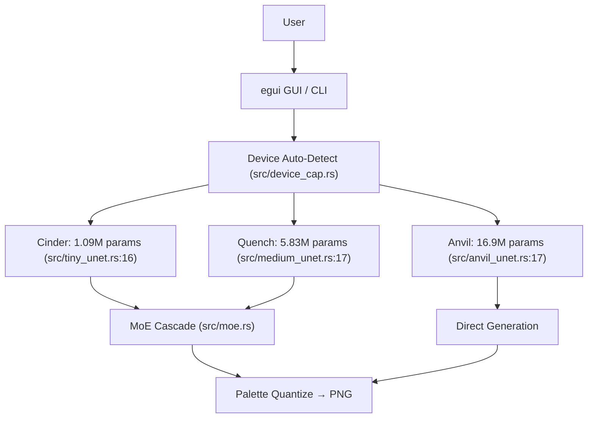

<!-- Unlicense — cochranblock.org -->

# Proof of Artifacts

*Concrete evidence that this project builds, trains, and generates output. Source-linked.*

## Architecture



Note: Expert heads, Judge model, and Scene generation exist as code but are not validated at output quality. See Status column below.

## Build Output

| Metric | Value | Source |
|--------|-------|--------|
| Lines of Rust | ~11,370 across 30 .rs files | `find src -name "*.rs" \| xargs wc -l` |
| Direct dependencies | 16 required + 3 optional | [Cargo.toml:27](Cargo.toml#L27) |
| Binary size (macOS ARM) | 9.2 MB (opt-level=z, LTO, strip) | [release/](release/) |
| Binary size (macOS x86) | 7.6 MB | [release/](release/) |
| Binary size (Linux x86) | 11.3 MB | [release/](release/) |
| Model: Cinder | 1.09M params, 4.2 MB | [src/tiny_unet.rs:16](src/tiny_unet.rs#L16), channels `[32,64,64]` |
| Model: Quench | 5.83M params, 22 MB | [src/medium_unet.rs:17](src/medium_unet.rs#L17), channels `[64,128,128]` |
| Model: Anvil | 16.9M params, 64.5 MB | [src/anvil_unet.rs:17](src/anvil_unet.rs#L17), channels `[96,192,192]` |
| Param count verification | Assertions in test | [src/device_cap.rs:492](src/device_cap.rs#L492) |
| Training data (balanced) | 19,876 tiles, 68 active classes, capped 2K/class | [train::preprocess](src/train.rs#L221), count at [train.rs:320](src/train.rs#L320) |
| Training data (unbalanced) | 75K+ tiles in `data_v2_32/`, 108 class dirs | [class_cond.rs:84](src/class_cond.rs#L84) (lookup table) |
| Dataset composition | ~30% artist-made CC0/CC-BY, ~70% Gemini-generated | [data/SOURCES.md](data/SOURCES.md) |
| Dataset size (compressed) | ~24 MB zstd bincode (RAM-loaded, zero disk I/O) | [train.rs:321](src/train.rs#L321) |
| Class conditioning | 10 super-categories + 12 binary tags | [class_cond.rs:12](src/class_cond.rs#L12), [class_cond.rs:16](src/class_cond.rs#L16) |
| ML framework | Candle 0.8 (Metal, CUDA, CPU) | [Cargo.toml:32](Cargo.toml#L32) |
| Governance docs | 11 documents baked into binary | [main.rs:10](src/main.rs#L10) via `include_str!` |
| Noise type | Gaussian N(0,1) | [train.rs:432](src/train.rs#L432) (corrupt function) |
| Prediction target | Clean image | [train.rs:759](src/train.rs#L759) (DEFAULT_CFG_SCALE) |
| CFG scale | 3.0 (fixed from 1.0 on 2026-04-02) | [train.rs:759](src/train.rs#L759), commit `68f2183a` |
| Augmentation | palette swap, h-flip, rotation (0/90/180/270) | [train.rs:348](src/train.rs#L348), [train.rs:399](src/train.rs#L399), [train.rs:413](src/train.rs#L413) |

## Training Loss (Anvil v6, 200 epochs on lf RTX 3070)

Source: `train-anvil-v6.log` on lf (`ssh lf 'cat ~/pixel-forge/train-anvil-v6.log'`)

| Epoch | Loss | LR | Time/epoch |
|-------|------|----|------------|
| 1 | 0.1927 | 1.0e-5 | 753s |
| 6 | 0.0799 | 1.1e-4 | 769s |
| 51 | 0.0654 | 1.8e-4 | 761s |
| 101 | 0.0653 | 1.1e-4 | 750s |
| 151 | 0.0562 | 4.1e-5 | 740s |
| 200 | 0.0542 | 1.0e-5 | 756s |

Total training time: 151,441 seconds (~42 hours). Config: bs=16, lr=2e-4, cosine decay, no EMA, min-SNR=5.

**Anvil v7** (in progress as of 2026-04-02): fine-tuning from v6, bs=8, lr=5e-5, rotation augmentation, no EMA. Running on lf CPU.

## QA Results (2026-03-27, updated 2026-04-02)

| Test | Result | Notes |
|------|--------|-------|
| `cargo build --release` | PASS | 0 errors, 0 warnings |
| `cargo clippy --release -- -D warnings` | PASS | 0 remaining lints |
| Clean build | PASS | ~57s incremental, ~5m from scratch |

## Key Artifacts

| Artifact | Status | Source |
|----------|--------|--------|
| Diffusion training loop | working | [src/train.rs:501](src/train.rs#L501) |
| Anvil UNet (16.9M params) | working, training | [src/anvil_unet.rs](src/anvil_unet.rs) |
| Quench UNet (5.83M params) | working, trained | [src/medium_unet.rs](src/medium_unet.rs) |
| Cinder UNet (1.09M params) | working, trained | [src/tiny_unet.rs](src/tiny_unet.rs) |
| MoE Cascade pipeline | code exists, not validated at quality | [src/moe.rs:72](src/moe.rs#L72) |
| Expert Routing | code exists, not validated at quality | [src/expert.rs](src/expert.rs), [src/expert_train.rs](src/expert_train.rs) |
| Judge Model | code exists, needs swipe training data | [src/judge.rs](src/judge.rs) |
| LoRA Adapters | code exists, needs judge model | [src/lora.rs](src/lora.rs) |
| Scene Generation | code exists, needs trained combiner | [src/scene.rs](src/scene.rs), [src/combiner.rs](src/combiner.rs) |
| Device Auto-Detect | working | [src/device_cap.rs:369](src/device_cap.rs#L369) |
| f16 Quantization | working | [src/quantize.rs:40](src/quantize.rs#L40) |
| Proof of Authorship | working | [src/poa.rs](src/poa.rs) (Ed25519 signed) |
| Hybrid Conditioning | working | [src/class_cond.rs:12](src/class_cond.rs#L12) |
| Cluster Distribution | working | [src/cluster.rs:20](src/cluster.rs#L20) (4 SSH nodes) |
| Relight (4-dir sprites) | working | [src/relight.rs](src/relight.rs) |
| Palette Quantization | working | [src/palette.rs:55](src/palette.rs#L55) |
| Governance Docs | working (self-assessed) | [govdocs/](govdocs/), [main.rs:10](src/main.rs#L10) |
| Android AAB | builds, not published | [android/](android/) |
| `--resume` fine-tuning | working | [src/train.rs:59](src/train.rs#L59), commit `d4b28270` |

## Training Data Sources

| Source | Count | License | Notes |
|--------|-------|---------|-------|
| Dungeon Crawl Stone Soup | ~6,000 | CC0 | [data/SOURCES.md](data/SOURCES.md) |
| DawnLike v1.81 | ~5,000 | CC-BY 4.0 | [data/SOURCES.md](data/SOURCES.md) |
| Kenney (3 packs) | ~3,878 | CC0 | [data/SOURCES.md](data/SOURCES.md) |
| Hyptosis Tiles | ~1,000 | CC-BY 3.0 | [data/SOURCES.md](data/SOURCES.md) |
| David E. Gervais Tiles | ~1,280 | CC-BY 3.0 | [data/SOURCES.md](data/SOURCES.md) |
| **Gemini-generated** | **~14,000** | **AI-generated** | Fills class gaps. ~70% of balanced set. |

## How to Verify

```bash
cargo build --release -p pixel-forge
cargo run --release -- anvil character --count 4 --steps 40 --palette stardew
cargo run --release -- probe              # Device detection
cargo run --release                       # Launch GUI
find src -name "*.rs" | xargs wc -l       # Line count
```

## Related Projects

- [kova](https://github.com/cochranblock/kova) — augment engine that drives pixel-forge via [plugin protocol](src/plugin.rs)
- [any-gpu](https://github.com/cochranblock/any-gpu) — wgpu/Vulkan tensor engine (in development), planned as future backend for cross-vendor GPU training
- [cochranblock](https://github.com/cochranblock/cochranblock) — the website that hosts all of this
- [approuter](https://github.com/cochranblock/approuter) — reverse proxy serving cochranblock.org

---

*Part of the [CochranBlock](https://cochranblock.org) zero-cloud architecture. All source under the [Unlicense](LICENSE).*
