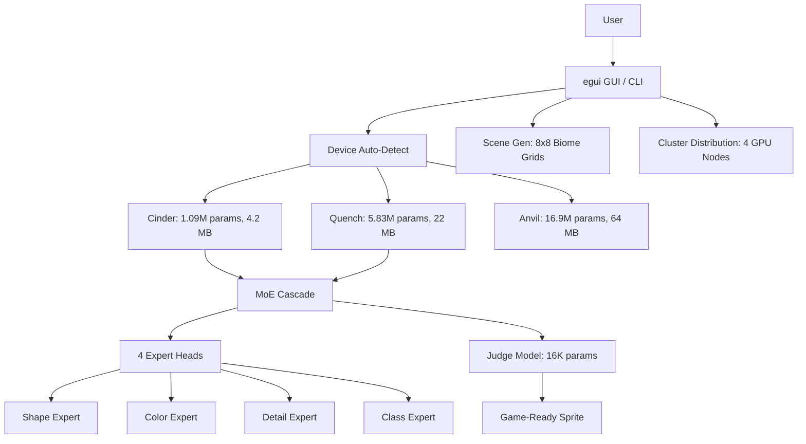

<!-- Unlicense — cochranblock.org -->

# Proof of Artifacts

*Concrete evidence that this project works, ships, and is real.*

> Three AI models. First MoE diffusion under 30MB. Pure Rust. No cloud.

## Architecture



## Build Output

| Metric | Value |
|--------|-------|
| Lines of Rust | 11,313 across 30 modules |
| Public functions | 168 across all modules |
| Direct dependencies | 19 (16 required + 3 optional) |
| Binary size (desktop) | 9.2 MB (opt-level=z, LTO, strip) |
| Binary size (before) | 25.8 MB (default release profile) |
| Model: Cinder v2 | 1.09M params, 4.2 MB, hybrid conditioning |
| Model: Quench v2 | 5.83M params, 22 MB, hybrid conditioning |
| Model: Anvil | 16.9M params, 64 MB |
| MoE cascade | Cinder + Quench + 4 experts = under 30 MB |
| Judge model | 16K params — quality gate in microseconds |
| Training data | 75,182 curated sprites from 7 CC0/CC-BY + Gemini sources |
| Class directories | 108 across 10 super-categories |
| Dataset size | 73 MB zstd-compressed bincode (RAM-loaded, zero disk I/O) |
| Android AAB | 30 MB (Cinder-only bundle) |
| Android APK | ~20 MB estimated (Cinder-only, post size-optimize) |
| Sprite classes | 108 via hybrid conditioning (10 supers + 12 tags) |
| ML framework | Candle (pure Rust — Metal, CUDA, CPU) |
| Federal govdocs | 11 documents (SBOM, SSDF, FIPS, CMMC, etc.) |

## QA Results (2026-03-27)

| Round | Test | Result |
|-------|------|--------|
| QA Round 1 | `cargo build --release` | PASS — 0 errors, 0 warnings |
| QA Round 1 | `git status` | PASS — all committed |
| QA Round 2 | `cargo clean && cargo build --release` | PASS — 5m28s from scratch |
| QA Round 2 | `cargo clippy --release -- -D warnings` | PASS — 46 lints fixed, 0 remaining |
| QA Round 2 | test binary | N/A — no test feature |
| User Story | Empty class validation | PASS — clear error |
| User Story | Count=0 validation | PASS — clear error |
| User Story | Missing model validation | PASS — helpful error with training instructions |
| User Story | Invalid palette | PASS — lists available palettes |

## Key Artifacts

| Artifact | Description |
|----------|-------------|
| MoE Cascade | First under 30MB — Cinder drafts (10 steps), Quench + 4 expert heads refine (30 steps) |
| Expert Routing | Shape (steps 1-10), Color (11-20), Detail (21-30), Class (31-40) |
| Judge Model | Binary classifier trained from user swipes — filters bad sprites in microseconds |
| LoRA Adapters | Rank-4 on all conv layers — fine-tune from 200 swipes without retraining |
| Scene Generation | 8x8 biome grids (dungeon, forest, cave, village, space) with constraint satisfaction |
| Device Auto-Detect | Probes GPU/RAM, selects optimal tier, benchmarks, degrades gracefully |
| f16 Quantization | Halves model sizes for mobile without quality loss |
| Proof of Authorship | Ed25519 signed Ghost Fabric packets |
| Hybrid Conditioning | 10 super-categories + 12 binary tags — new classes without retraining |
| Play Store Pipeline | deploy-play.sh: cargo ndk → bundleRelease → fastlane supply |
| Federal Governance | 11 docs: SBOM, SSDF, FIPS, CMMC, ITAR/EAR, FedRAMP, etc. |

## Training Data Sources

| Source | Count | License |
|--------|-------|---------|
| Dungeon Crawl Stone Soup | 6,000+ | CC0 |
| DawnLike v1.81 | 5,000+ | CC-BY 4.0 |
| Kenney Roguelike/RPG | 1,700 | CC0 |
| Kenney Pixel Platformer | 1,100 | CC0 |
| Kenney 1-Bit Pack | 1,078 | CC0 |
| Hyptosis Tiles | 1,000+ | CC-BY 3.0 |
| David E. Gervais Tiles | 1,280 | CC-BY 3.0 |

## How to Verify

```bash
cargo build --release -p pixel-forge
cargo run --release -- auto character    # Auto-detect hardware, generate sprite
cargo run --release -- cascade character --count 16   # MoE cascade
cargo run --release                      # Launch GUI
```

---

*Part of the [CochranBlock](https://cochranblock.org) zero-cloud architecture. All source under the Unlicense.*
