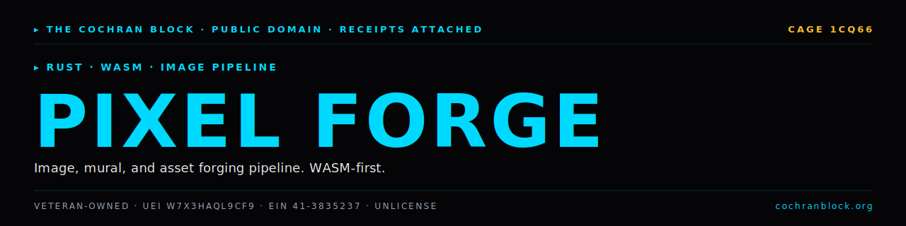

<!-- COCHRANBLOCK-BRAND-HEADER:START - generated by cochranblock/scripts/brand-stamp.sh -->
<picture>
  <source media="(prefers-color-scheme: dark)" srcset="assets/brand/banner.svg">
  <source media="(prefers-color-scheme: light)" srcset="assets/brand/banner.svg">
  
</picture>

[](https://unlicense.org)
[](https://www.rust-lang.org)
[](https://cochranblock.org)
[](https://cochranblock.org)

> &#9656; **RUST** &#183; **WASM** &#183; **IMAGE PIPELINE**
<!-- COCHRANBLOCK-BRAND-HEADER:END -->


<p align="center">
  
</p>

# Pixel Forge v0.6.0

**Pixel art sprite generator. Three diffusion models. Pure Rust. No cloud.**

Trains and runs Karras EDM diffusion models that generate 32×32 pixel art sprites. Runs locally on CPU, Metal (Apple), CUDA (NVIDIA), or Vulkan (AMD/Intel via [any-gpu](https://github.com/cochranblock/any-gpu)). No Python. No cloud APIs.

---

## Documentation

This README is the entry point. The actual docs live in two source-of-truth files at the root of the repo:

- **[PROOF_OF_ARTIFACTS.md](PROOF_OF_ARTIFACTS.md)** — what exists today, status, source-linked. Build output, model tiers, CLI commands, platforms, training data, bug history, recipe migration status. If you want to know what this project *does*, read this.
- **[TIMELINE_OF_INVENTION.md](TIMELINE_OF_INVENTION.md)** — dated, commit-level record of what was built, when, and why. Human revelations (NanoSign, MoE Cascade, Hybrid Conditioning, EDM migration), AI/Human role splits per entry. If you want to know how this project *got built*, read this.

Supporting docs:
- [BACKLOG.md](BACKLOG.md) — prioritized open work
- [ATTRIBUTION.md](ATTRIBUTION.md) — credits
- [CONTRIBUTORS.md](CONTRIBUTORS.md) — contributor list
- [docs/compression_map.md](docs/compression_map.md) — P13 tokenization (fN/tN/MN/cN)
- [docs/MOE_PLAN.md](docs/MOE_PLAN.md) — MoE cascade design

---

## Run It

```bash
cargo build --release                     # Metal (macOS) or CPU
cargo build --release --features cuda --no-default-features  # NVIDIA
cargo build --release --features vulkan   # AMD/Intel via any-gpu
cargo run --release                       # Launch GUI
cargo run --release -- anvil character --count 4 --steps 40 --palette stardew
```

Full build, train, and CLI examples in [PROOF_OF_ARTIFACTS.md → Quick Start](PROOF_OF_ARTIFACTS.md#quick-start).

---

## License

Unlicense (public domain). See [LICENSE](LICENSE).

Built by [The Cochran Block](https://cochranblock.org). Powered by [KOVA](https://github.com/cochranblock/kova).
<!-- COCHRANBLOCK-BRAND-FOOTER:START - generated by cochranblock/scripts/brand-stamp.sh -->

---

<sub>&#9656; **THE COCHRAN BLOCK, LLC** &#183; Veteran-Owned &#183; **CAGE** `1CQ66` &#183; **UEI** `W7X3HAQL9CF9` &#183; **EIN** `41-3835237`</sub>

<sub>&#9656; PUBLIC DOMAIN &#183; UNLICENSE &#183; RECEIPTS ATTACHED &#183; [**cochranblock.org**](https://cochranblock.org) &#183; [github.com/cochranblock](https://github.com/cochranblock)</sub>
<!-- COCHRANBLOCK-BRAND-FOOTER:END -->
