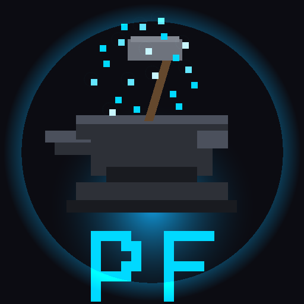

<p align="center">
  
</p>

# Pixel Forge v0.5.0

**Free pixel art generator. Three AI models. First MoE diffusion under 30MB. Pure Rust.**

Generate game-ready pixel art sprites from tiny diffusion models that fit in a mobile binary. No cloud. No Python. No subscription. One language.

## What It Does

- **Generate** pixel art sprites from 16 classes (character, weapon, terrain, enemy, etc.)
- **Train** your own models on curated artist-made pixel art datasets
- **Three tiers** — Cinder (4.2 MB, fast), Quench (22 MB, balanced), Anvil (64 MB, highest quality)
- **f16 quantization** — halve model size for mobile (Cinder: 2.1 MB, Quench: 11 MB)
- **MoE cascade** — Cinder drafts, Quench + 4 expert heads refine. Better than either alone.
- **Judge model** — binary quality classifier filters bad sprites automatically
- **LoRA adapters** — fine-tune from user feedback without retraining
- **Scene generation** — 8x8 biome grids with rule-based or model-based placement
- **Cluster distribution** — fan out generation across GPU nodes
- **GUI + Android app** — touch-friendly, device auto-detection, Cinder-only APK under 10 MB

## Architecture

```
                    Cinder (1.1M)          Quench (5.8M)         Anvil (16.9M)
                    ┌────────────┐         ┌────────────┐        ┌────────────┐
  Noise ──────────► │ 10 steps   │ ──────► │ 30 steps   │        │ 100 steps  │
                    │ fast draft │         │ + experts  │        │ full qual  │
                    └────────────┘         └─────┬──────┘        └────────────┘
                                                 │
                              ┌──────┬───────────┼───────────┬──────┐
                              ▼      ▼           ▼           ▼      │
                           Shape   Color      Detail      Class     │
                           ~50K    ~50K       ~50K        ~50K      │
                              └──────┴─────┬─────┴──────────┘      │
                                           ▼                        │
                                    Palette Quantize ◄──────────────┘
                                           ▼
                                    Game-Ready PNG
```

## Quick Start

```bash
# Train Cinder (tiny, ~2 min on GPU)
cargo run --release -- train --data data --epochs 100 --img-size 16

# Train Quench (medium, ~20 min on GPU)
cargo run --release -- train --data data --epochs 100 --img-size 16 --medium

# Generate
cargo run --release -- generate character --palette stardew -o hero.png

# MoE cascade (Cinder drafts → Quench + Experts refines)
cargo run --release -- cascade character --count 16 -o characters.png

# Auto-detect device, pick best model
cargo run --release -- auto character

# Launch GUI
cargo run --release
```

## Commands

| Command | What It Does |
|---------|-------------|
| `generate <class>` | Generate via trained model |
| `train` | Train tiny/medium/XL model from dataset |
| `cascade <class>` | MoE cascade: Cinder → Quench + Experts |
| `auto <class>` | Auto-detect GPU, pick best model |
| `quantize <model>` | Convert f32 → f16 (halves file size) |
| `train-experts` | Train 4 expert heads on frozen Quench |
| `train-judge` | Train quality classifier from swipe data |
| `train-lora` | Fine-tune generator from Judge feedback |
| `train-combiner` | Train scene layout model |
| `scene <mode>` | Generate 8x8 biome grids |
| `pipeline` | Full pipeline: generate → judge → combine → render |
| `forge <class>` | Generate → discriminator gate → PoA sign |
| `curate` | Slice sprite sheets into training tiles |
| `swipe <image> <verdict>` | Record good/bad judgments |
| `judge <input>` | Score sprite quality |
| `probe` | Device capability detection |
| `gpu <args>` | GPU scheduling (delegates to `kova c2 gpu`) |
| `cluster-probe` | Probe all forge cluster nodes |
| `cluster-deploy` | Sync binary to all nodes |
| `cluster-generate` | Distribute generation across cluster |
| `plugin` | JSON protocol for kova integration |
| `palettes` | List built-in palettes |

## Model Tiers

| Tier | Name | Params | Size | Channels | Use Case |
|------|------|--------|------|----------|----------|
| Tiny | **Cinder** | 1.09M | 4.2 MB (2.1 f16) | [32, 64, 64] | Fast draft, mobile |
| Medium | **Quench** | 5.83M | 22 MB (11 f16) | [64, 128, 128] + self-attention | Balanced quality/speed |
| XL | **Anvil** | 16.9M | 64 MB (32 f16) | 3-level, deeper ResBlocks | Highest quality, desktop |

### Expert Heads (MoE)

4 specialist heads (~50K params each, ~804 KB total) on frozen Quench base:

| Expert | Stage | Function |
|--------|-------|----------|
| Shape | Steps 1-10 | Silhouette, edge definition |
| Color | Steps 11-20 | Palette coherence, color clustering |
| Detail | Steps 21-30 | Texture, shading, dithering |
| Class | Steps 31-40 | Class identity verification |

## Training Pipeline

- **52,139 curated tiles** from 7 quality-gated CC0/CC-BY sources
- No AI-generated images. No copyrighted game rips.
- Cosine noise schedule + min-SNR weighting + CFG dropout (10%) + EMA tracking
- Zero disk I/O during training — all data in RAM from bincode+zstd cache

See [data/SOURCES.md](data/SOURCES.md) for full attribution.

## Training Data Sources

| Source | Sprites | License | Artist |
|--------|---------|---------|--------|
| Dungeon Crawl Stone Soup | 6,000+ | CC0 | DCSS art team |
| DawnLike v1.81 | 5,000+ | CC-BY 4.0 | DragonDePlatino + DawnBringer |
| Kenney Roguelike/RPG | 1,700 | CC0 | Kenney |
| Kenney Pixel Platformer | 1,100 | CC0 | Kenney |
| Kenney 1-Bit Pack | 1,078 | CC0 | Kenney |
| Hyptosis Tiles | 1,000+ | CC-BY 3.0 | Hyptosis |
| David E. Gervais Tiles | 1,280 | CC-BY 3.0 | David E. Gervais |

## Built-In Palettes

| Palette | Colors | Vibe |
|---------|--------|------|
| stardew | 48 | Warm earth tones (ConcernedApe inspiration) |
| starbound | 64 | Vibrant sci-fi |
| endesga32 | 32 | Popular indie pixel art |
| pico8 | 16 | PICO-8 fantasy console |
| snes | 256 | Super Nintendo |
| nes | 54 | Nintendo Entertainment System |
| gameboy | 4 | Original Game Boy |

## Tech Stack

| Layer | Tool |
|-------|------|
| ML Framework | Candle (Hugging Face) |
| GPU | Metal (Apple Silicon), CUDA (NVIDIA), CPU fallback |
| Serialization | bincode + zstd (dataset), safetensors (models) |
| GUI | egui / eframe |
| CLI | clap |
| GPU Scheduling | kova c2 gpu (file-based lock + priority queue) |

Zero Python. Zero JavaScript. One language. 9,162 lines of Rust.

## Attribution

See [ATTRIBUTION.md](ATTRIBUTION.md) for full credits including:
- PixelGen16x16 by Anouar Khaldi (architecture inspiration)
- pixartdiffusion by Zak Buzzard (training patterns)
- ConcernedApe / Eric Barone (Stardew Valley palette inspiration)
- Candle by Hugging Face (ML framework)

## License

Unlicense (public domain). See [LICENSE](LICENSE).

---

Built by [The Cochran Block](https://cochranblock.org). Powered by [KOVA](https://github.com/cochranblock/kova).
